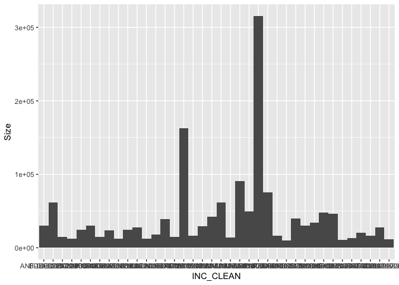

ICS 209 Data
================
Amy Van Scoyoc
2/20/2019

About ICS 209 Data
------------------

-   Source: <https://fam.nwcg.gov/fam-web/hist_209/report_list_209>
-   Data Time Span: 2002-2013
-   Date Extracted: 2/19/19
-   Region: Northern California, Southern California
-   Metadata: Data were copied from website tables into .xlsx document from N/S California from 2002-2013. Data from 2007 and after had a different column structure, so 'State Unit', 'Incident Type' and 'Measurement' columns were added and left blank for 2002-2006.mData were then saved to .csv file imported here.

Packages
--------

``` r
library(tidyverse)
library(stringr)
library(gtools)  #used for smartbind() function
```

Data Cleaning and transformation
--------------------------------

``` r
#import data
ics_209 <- read.csv("data/ICS_209_reports.csv", header = TRUE, stringsAsFactors = FALSE)
head(ics_209)
```

    ##        ICS_209_region State.Unit Incident.Number      Incident.Name
    ## 1 Northern California              CA MEU-007499              BURNS
    ## 2 Northern California                                  DEL WALTERS 
    ## 3 Northern California                              BC LARRY GRAFFT 
    ## 4 Northern California                CA-BOD-2109          RUSH FIRE
    ## 5 Northern California              CA-BTU-006327             SKYWAY
    ## 6 Northern California                            D2101 BILL HOLMES 
    ##   Incident.Type      Start.Date        IC.Name Team.Type  Latitude
    ## 1               09/19/2002 1500     L. Grafft            39.768056
    ## 2                            1                                    
    ## 3                                                                 
    ## 4               07/13/2002 1812 L. SZCZEPANIK         2  40.633333
    ## 5               06/08/2002 1408     KURT HOAG         1  39.700833
    ## 6                            1                                    
    ##    Longitude        Size Measurement       Costs Controlled.Date
    ## 1 123.551389   485 ACRES             $1,144,454  09/26/2002 0800
    ## 2                                                               
    ## 3                                                               
    ## 4 120.134167 3,000 ACRES               $100,000                 
    ## 5 121.751389 1,000 ACRES               $250,000  06/10/2002 0800
    ## 6                                                               
    ##   Structures.Destroyed
    ## 1                     
    ## 2                     
    ## 3                     
    ## 4                     
    ## 5                     
    ## 6

``` r
ics_209 <- ics_209 %>% 
  ##filter and clean all data
  filter(Incident.Name != "Incident Name") %>%  #remove header rows from sheet 
  map_dfr(str_trim) %>%     #trim all the white space
  #as.data.frame() %>%   #for old way I mapped trimming white space, ignore
  filter(Incident.Number != "") %>% #remove rows without incident numbers
  filter(!str_detect(Incident.Number, "^HI")) %>% #remove Hawaii data
  filter(Latitude != "") %>% #remove duplicate rows with personnel names
  ##format rows
  transform(Start.Date = as.Date(Start.Date, format = "%m/%d/%Y")) %>% 
  transform(Controlled.Date = as.Date(Controlled.Date, format = "%m/%d/%Y")) %>% 
  transform(Costs = as.numeric(gsub("[\\$,]", "", Costs))) %>%
  transform(Size = as.numeric(gsub("[\\ACRES,]", "", Size))) %>% 
  ##cleaning incident number col
  transform(Incident.Number = gsub(" ", "-", Incident.Number)) %>% #substitute white space for dash
  transform(Incident.Number = gsub("--", "-", Incident.Number)) %>% #remove any double dash instances
  transform(Incident.Number = gsub("CA-","", Incident.Number)) %>% #remove CAs from incident num.
  #transform(Incident.Number = gsub("^([A-Z]{3})([0-9]+)$", "-", Incident.Number)) %>%  #add dash ids (not working)
  mutate(unit = str_extract(Incident.Number, "[A-Z]+")) %>%  #extract unit from incident num.
  mutate(inc.num = str_extract(Incident.Number, "[^-]+$")) %>% #extract unit numbers
  transform(inc.num = formatC(as.numeric(inc.num), width = 8, format = "d", flag = "0")) %>% #pad to 8 digits
  mutate(INC_CLEAN = paste0(unit, "-", inc.num)) %>% #merge cleaned numbers 
  #add year column
  mutate(year = str_extract(Start.Date, "[^-]+"))
```

Load Alex data
--------------

``` r
# Import and clean alex data IDs
GIS <- read.csv("data/all_fire_data.csv") %>% filter(YEAR_ > 2000 & YEAR_ < 2014) %>% 
  unite("inc", UNIT_ID, INC_NUM, sep = "-") %>% 
  mutate(INC_CLEAN = gsub(" ", "", inc))
```

Join to spatial dataset
-----------------------

``` r
# Join datasets and filter to greater than 10,000 acres
fire_data_joined <- left_join(GIS, ics_209, by = "INC_CLEAN") %>% 
  filter(!is.na(year), GIS_ACRES > 10000) 
```

View dataset
------------

``` r
# Create test dataframe to compare join success
fire_data_joined %>% 
  select(INC_CLEAN,YEAR_, year, GIS_ACRES, Size, FIRE_NAME, Incident.Name, Structures.Destroyed, Costs) 
```

    ##       INC_CLEAN YEAR_ year GIS_ACRES   Size        FIRE_NAME
    ## 1  KRN-00018055  2007 2007   12432.2  12454            WHITE
    ## 2  MVU-00010643  2007 2007   49411.0  49410         POOMACHA
    ## 3  SCU-00005214  2007 2007   47748.3  47760             LICK
    ## 4  MVU-00010427  2007 2007   90728.3  90440         HARRIS 2
    ## 5  RRU-00035517  2004 2004   16447.4  16460          CERRITO
    ## 6  BEU-00002665  2006 2006   14509.4  14507             RICO
    ## 7  RRU-00082809  2003 2003   10331.4  10331         MOUNTAIN
    ## 8  SCU-00003581  2003 2003   18210.4  30170            ANNIE
    ## 9  HUU-00004435  2003 2003   11043.6  24882            CANOE
    ## 10 LNU-00007867  2004 2004   38763.0  39138           RUMSEY
    ## 11 LNU-00006644  2004 2004   12244.4  12525          GEYSERS
    ## 12 LPF-00001113  2006 2006   14923.0  15043          PERKINS
    ## 13 BDU-00007229  2006 2006   61767.2  61700 SAWTOOTH COMPLEX
    ## 14 MVU-00005658  2002 2002   61691.2  61690            PINES
    ## 15 LAC-00208724  2005 2005   23396.4  24175          TOPANGA
    ## 16 SHU-00006398  2004 2004   12675.4  13005           FRENCH
    ## 17 SHU-00006278  2004 2004   10441.7  10848             BEAR
    ## 18 KNF-00003497  2006 2006   21866.1  30454          HANCOCK
    ## 19 MNF-00000894  2006 2006   16234.3  16296           HUNTER
    ## 20 SRF-00000997  2006 2006   15506.2  16172            SOMES
    ## 21 LPF-00002023  2006 2006  161816.0 162702              DAY
    ## 22 RRU-00091190  2006 2006   40176.8  40200        ESPERANZA
    ## 23 SCU-00004303  2006 2006   34217.5  34217           CANYON
    ## 24 MVU-00008019  2011 2011   13993.0  14100            EAGLE
    ## 25 SQF-00002087  2011 2011   20681.5  20500             LION
    ## 26 CDD-00011542  2012 2012   12015.2  12018  JAWBONE COMPLEX
    ## 27 KNF-00005659  2012 2012   22266.9  23658             GOFF
    ## 28 LNU-00007072  2012 2012   17942.1  17944  SIXTEEN_COMPLEX
    ## 29 MNF-00001109  2012 2012   29525.5  29052             MILL
    ## 30 MNF-00001446  2012 2012   41812.5  41983       NORTH PASS
    ## 31 NOD-00003490  2012 2012  315512.0 315577             RUSH
    ## 32 PNF-00001001  2012 2012   76349.7  75431            CHIPS
    ## 33 SHF-00002744  2012 2012   46040.1  46011           BAGLEY
    ## 34 TGU-00006696  2012 2012   27670.4  27676        PONDEROSA
    ## 35 ANF-00002297  2013 2013   30267.7  30274       POWERHOUSE
    ## 36 KNF-00005561  2013 2010   14785.9    371   SALMON COMPLEX
    ## 37 KNF-00005561  2013 2013   14785.9  14750   SALMON COMPLEX
    ## 38 TGU-00006768  2013 2013   11428.8  11429             DEER
    ## 39 LNP-00003115  2012 2012   28073.2  28079          READING
    ##           Incident.Name Structures.Destroyed    Costs
    ## 1                 White                   31  9361256
    ## 2              Poomacha                  217       NA
    ## 3                  LICK                   24 11859113
    ## 4                HARRIS                  548 21000000
    ## 5               Cerrito                   24       NA
    ## 6                  RICO                    1       NA
    ## 7              Mountain                   61  2227790
    ## 8   Santa Clara Complex                    1       NA
    ## 9        Canoe/Honeydew                            NA
    ## 10               RUMSEY                    6 10282654
    ## 11              GEYSERS                   21 11543068
    ## 12      PERKINS COMPLEX                       1300000
    ## 13     SAWTOOTH COMPLEX                  221 17850000
    ## 14                PINES                  153 24976052
    ## 15              Topanga                   13 16976870
    ## 16               FRENCH                  103  1881643
    ## 17                 BEAR                  110  9431236
    ## 18       Uncles Complex                       1551600
    ## 19               HUNTER                            NA
    ## 20      ORLEANS COMPLEX                    1       NA
    ## 21                  DAY                   11 78000000
    ## 22            Esperanza                   54 10600000
    ## 23               CANYON                   16       NA
    ## 24                EAGLE                    1 15500000
    ## 25                 LION                       2100000
    ## 26      JAWBONE COMPLEX                   19  8138604
    ## 27         Fort Complex                      26747381
    ## 28      SIXTEEN COMPLEX                       4455782
    ## 29                 MILL                    5 15400000
    ## 30           North Pass                   26 30493184
    ## 31                 RUSH                      15170000
    ## 32                CHIPS                    9 53300000
    ## 33               Bagley                      37063416
    ## 34            PONDEROSA                  133 33051301
    ## 35           POWERHOUSE                   58 27321000
    ## 36                DUTCH                       2900000
    ## 37 Salmon River Complex                      22750000
    ## 38                 DEER                       7474714
    ## 39              Reading                      18000000

**It looks like only 520 rows, only 39 are greater than 10,000 acres, were joined with Alex's dataset.**

Take a look at the plot of these values and fire sizes below.

``` r
ggplot(fire_data_joined, aes(x = INC_CLEAN, y = Size)) +
geom_bar(stat = "identity", width = 1)
```



Troubleshooting
---------------

To troubleshoot why so many rows didn't match, I create data tables with only GIS data and ICS data that didn't match to examine further. I merge these into a table to view what is wrong with the incident numbers. It seems to be a problem with the GIS incident numbers and the jurisdictions from Alex's dataset. There are ~100 additional fires greater than 10000 acres in here that could be partially matched and added to the 39 above.

``` r
join_only_gis <- left_join(GIS, ics_209, by = "INC_CLEAN") %>% 
  filter(is.na(year)) %>% 
  rename(Size = GIS_ACRES, year = YEAR_, Incident.Name = FIRE_NAME, Start.Date = ALARM_DATE)

join_only_ics <- left_join(ics_209, GIS, by = "INC_CLEAN") %>% 
  filter(is.na(YEAR_)) %>% 
  transform(Costs = as.numeric(Costs)) %>%
  transform(Size = as.numeric(Size)) 

full <- smartbind(join_only_gis, join_only_ics) %>% 
  select(year, Size, Incident.Name, Start.Date, INC_CLEAN, inc, OBJECTID, Structures.Destroyed, Costs) %>% 
  transform(Size = as.numeric(Size)) %>% 
  transform(Costs = as.numeric(Costs)) %>% 
  transform(Structures.Destroyed = as.integer(Structures.Destroyed)) %>% 
  filter(Size > 10000) 

head(full)
```

    ##   year    Size Incident.Name Start.Date    INC_CLEAN          inc OBJECTID
    ## 1 2007 58410.3         RANCH 2007-10-20 ANF-00000166 ANF-00000166        3
    ## 2 2007 21493.9          AMMO 2007-10-23 MCP-00000000 MCP-00000000       78
    ## 3 2007 28430.0      SANTIAGO 2007-10-21 ORC-00000085 ORC-00000085       91
    ## 4 2007 12769.2         SLIDE 2007-10-22 BDF-00000167 BDF-00000167       94
    ## 5 2007 64960.0     MOONLIGHT 2007-09-03 PNF-00000098 PNF-00000098      113
    ## 6 2007 27062.9           OAK 2007-07-06 INF-00000022 INF-00000022      116
    ##   Structures.Destroyed Costs
    ## 1                   NA    NA
    ## 2                   NA    NA
    ## 3                   NA    NA
    ## 4                   NA    NA
    ## 5                   NA    NA
    ## 6                   NA    NA

It is clear from this table that the incident numbers in Alex's data (rows with inc/OBJECTID filled in) don't match the ICS-209 incident numbers (rows with Structures/costs filled in). Next, we'll need to try some partial matching based on Start.Date, Incident.Name, and Size to see how many more rows we can merge to create a more complete dataset of the cost and structural loss that was associate with the fires greater than 10,000 acres between 2001-2013.

New Merge with Millie Data
--------------------------

**In Progress**

Millie got 239 fires greater than 10000 acres in her GIS file, SO, we need to import that data table and check what proportion of the ICS-209 data file is contained in it and if we can merge to this data instead.

``` r
shape <- read.csv("data/fires_millie.csv") 
head(shape)
```

    ##   X      MAPMETHOD AGENCY COMPLEXNM INCOMPLEX FIRE_NAME YEAR GIS_ACRES
    ## 1 1  Mixed Methods    CDF      <NA>         N      CAMP 2018 145134.81
    ## 2 2  Mixed Methods   USFS      <NA>         N      CARR 2018 229651.40
    ## 3 3 Infrared Image    CDF      <NA>         N    COUNTY 2018  89776.54
    ## 4 4 Infrared Image   USFS      <NA>         N  CRANSTON 2018  13229.16
    ## 5 5  Mixed Methods   USFS      <NA>         N     DELTA 2018  63505.60
    ## 6 6 Infrared Image   USFS      <NA>         N   DONNELL 2018  36544.62
    ##   ALARM_DATE CONT_DATE CAUSE YEARn
    ## 1       <NA>      <NA>     0    49
    ## 2       <NA>      <NA>     0    49
    ## 3       <NA>      <NA>     0    49
    ## 4       <NA>      <NA>     0    49
    ## 5       <NA>      <NA>     0    49
    ## 6       <NA>      <NA>     0    49

KC: Starting by removing duplicates from shape df so we know how many fire over 10,000 acres we're working wit.

``` r
#need to remove duplicates from new shape data

head(shape)
```

    ##   X      MAPMETHOD AGENCY COMPLEXNM INCOMPLEX FIRE_NAME YEAR GIS_ACRES
    ## 1 1  Mixed Methods    CDF      <NA>         N      CAMP 2018 145134.81
    ## 2 2  Mixed Methods   USFS      <NA>         N      CARR 2018 229651.40
    ## 3 3 Infrared Image    CDF      <NA>         N    COUNTY 2018  89776.54
    ## 4 4 Infrared Image   USFS      <NA>         N  CRANSTON 2018  13229.16
    ## 5 5  Mixed Methods   USFS      <NA>         N     DELTA 2018  63505.60
    ## 6 6 Infrared Image   USFS      <NA>         N   DONNELL 2018  36544.62
    ##   ALARM_DATE CONT_DATE CAUSE YEARn
    ## 1       <NA>      <NA>     0    49
    ## 2       <NA>      <NA>     0    49
    ## 3       <NA>      <NA>     0    49
    ## 4       <NA>      <NA>     0    49
    ## 5       <NA>      <NA>     0    49
    ## 6       <NA>      <NA>     0    49

``` r
#counting instances of duplicates by FIRE_NAME
n_occur <- data.frame(table(shape$FIRE_NAME))
n_occur[n_occur$Freq > 1,]
```

    ##         Var1 Freq
    ## 14      BEAR    2
    ## 34    CANYON    3
    ## 39     CEDAR    2
    ## 50    CORRAL    2
    ## 58     CROWN    2
    ## 63       DAY    2
    ## 69     EAGLE    2
    ## 76    FRENCH    2
    ## 88  HAYPRESS    2
    ## 112     LION    2
    ## 119     MILL    3
    ## 124 MOUNTAIN    2
    ## 129      OAK    2
    ## 155    RANCH    3
    ## 197   THOMAS    2

``` r
#Looks like 15 fires in the data set have some form of duplicate

duplicates <- shape[shape$FIRE_NAME %in% n_occur$Var1[n_occur$Freq > 1],]

# One true duplicate, Ranch fire is listed twice. Thinking about making Fire_Name = "Fire_Name + _YEAR" so each fire has a unique name. Testing with just the duplicates first 

duplicates$Fire_ID <- paste(duplicates$FIRE_NAME, as.character(duplicates$YEAR))


#applying this to the shape df
shape$FIRE_ID <- paste(shape$FIRE_NAME, as.character(shape$YEAR))
head(shape)
```

    ##   X      MAPMETHOD AGENCY COMPLEXNM INCOMPLEX FIRE_NAME YEAR GIS_ACRES
    ## 1 1  Mixed Methods    CDF      <NA>         N      CAMP 2018 145134.81
    ## 2 2  Mixed Methods   USFS      <NA>         N      CARR 2018 229651.40
    ## 3 3 Infrared Image    CDF      <NA>         N    COUNTY 2018  89776.54
    ## 4 4 Infrared Image   USFS      <NA>         N  CRANSTON 2018  13229.16
    ## 5 5  Mixed Methods   USFS      <NA>         N     DELTA 2018  63505.60
    ## 6 6 Infrared Image   USFS      <NA>         N   DONNELL 2018  36544.62
    ##   ALARM_DATE CONT_DATE CAUSE YEARn       FIRE_ID
    ## 1       <NA>      <NA>     0    49     CAMP 2018
    ## 2       <NA>      <NA>     0    49     CARR 2018
    ## 3       <NA>      <NA>     0    49   COUNTY 2018
    ## 4       <NA>      <NA>     0    49 CRANSTON 2018
    ## 5       <NA>      <NA>     0    49    DELTA 2018
    ## 6       <NA>      <NA>     0    49  DONNELL 2018

``` r
#Double checking for repeats
n_occur2 <- data.frame(table(shape$FIRE_ID))
n_occur2[n_occur2$Freq > 1,]
```

    ##            Var1 Freq
    ## 130   MILL 2008    2
    ## 170  RANCH 2018    2
    ## 212 THOMAS 2017    2

``` r
shape[shape$FIRE_ID %in% n_occur2$Var1[n_occur2$Freq > 1],]
```

    ##       X      MAPMETHOD AGENCY         COMPLEXNM INCOMPLEX FIRE_NAME YEAR
    ## 12   12 Infrared Image    CDF Mendocino Complex         Y     RANCH 2018
    ## 13   13  Mixed Methods    CDF Mendocino Complex         Y     RANCH 2018
    ## 18   18        Unknown    C&L              <NA>         N    THOMAS 2017
    ## 127 127           <NA>    USF              <NA>      <NA>      MILL 2008
    ## 135 135           <NA>    CDF              <NA>      <NA>      MILL 2008
    ## 232 232           <NA>    USF              <NA>      <NA>    THOMAS 2017
    ##     GIS_ACRES ALARM_DATE  CONT_DATE CAUSE YEARn     FIRE_ID
    ## 12  410202.53       <NA>       <NA>     0    49  RANCH 2018
    ## 13  410202.46       <NA>       <NA>     0    49  RANCH 2018
    ## 18  281795.83       <NA>       <NA>     0    48 THOMAS 2017
    ## 127  65882.04 2008-06-20 2008-10-03     1    39   MILL 2008
    ## 135  13511.76 2008-06-21 2008-06-29     1    39   MILL 2008
    ## 232 281790.88 2017-12-04 2018-01-12     9    48 THOMAS 2017

``` r
#how best to remove remaining duplicates?
#Double checking remaining fires and their GIS_ACRES
#CalFire says that the Ranch fire burned ~400,000 acres (whaa?! cray). So the two instances we have in the shape data are true duplicates (both GIS_ACRES are about the same)
#CalFire also has simialr estimates for burned acreage for both of our Thomas_2017 fires. So these two are true duplicates as well. 
#Not finding any definitive answer on the Mill 2008 fire. The acreage is really different too. I saw on wikipedia that it was listed as being ~13,000 acres, which seems to match one of the entries. But Im not sure where that data soruce came from... There are many Mill/Mill creek fires in different years, so I'm not sure how to work out which one the other is referring to. Maybe throw it/them out? 

#Remove duplicate RANCH 2018 fire
shape <- shape %>%
  filter(.,FIRE_ID != "RANCH 2018" | MAPMETHOD != "Mixed Methods")
#Remove duplicate THOMAS 2017 fire
shape <- shape %>%
  filter(., FIRE_ID != "THOMAS 2017" | AGENCY != "C&L")
```

Partial Matching Attempt
------------------------

**In Progress**

Here, I attempt to match:

-   `Incident.Name` by first 3 characters
-   `Start.Date` within 5 days of eachother
-   `Size` within 1000 acres of eachother

``` r
# Create ID column for both dataframes
# ID = First 3 characters of incident name + yyyy-mm of startdate

ics_209 <- ics_209 %>% 
  filter(Size > 10000, str_length(Incident.Name) > 2, !is.na(Start.Date)) %>% 
  transform(Incident.Name = toupper(Incident.Name)) %>% 
  mutate(ID = paste0(stringr::str_extract(Incident.Name, "^[A-Z[:space:]]{3}"),"-",as.character(str_extract(Start.Date, "[^-]*-[^-]*")))) %>% 
  arrange(ID)

shape <- shape %>% 
  mutate(ID = paste0(stringr::str_extract(FIRE_ID, "^[A-Z]{3}"),"-",as.character(str_extract(ALARM_DATE, "[^-]*-[^-]*")))) %>% 
  arrange(ID)
```

``` r
# Merge dataframes by new 'ID'
shape_w_ics <- left_join(shape, ics_209, by = "ID") %>% 
  filter(YEAR > 2002, YEAR < 2014) %>% #shape data is larger, so check rows matched only on filtered frame
  select(ID, FIRE_NAME, Incident.Name, ALARM_DATE, Start.Date, GIS_ACRES, Size, Costs, Structures.Destroyed) %>% 
  arrange(FIRE_NAME)

# Count of rows
# Matching: 89  Not Matching: 48

shape_w_ics %>% 
  filter(!is.na(Incident.Name)) %>% 
  nrow()
```

    ## [1] 89

``` r
# Check what fires are missing or incomplete from Shapefile data by merging opposite way

ics_w_shape <- left_join(ics_209, shape, by = "ID") %>% 
  select(ID, FIRE_NAME, Incident.Name, ALARM_DATE, Start.Date, GIS_ACRES, Size, Costs, Structures.Destroyed) %>% 
  arrange(Incident.Name)

# Count of rows
# Matching: 95  Not Matching: 33

ics_w_shape %>% 
  filter(!is.na(FIRE_NAME)) %>% 
  nrow()
```

    ## [1] 95

This is a problem....we get about a hundred through matching, but it's very possible that complex fires are divided up, this would mean that structures and costs would need to be added across dataframes. Not sure what to do here. At the very least we can use the shape\_w\_ics and build a preliminary figure with 89 fires (1/4 of the data we need).
