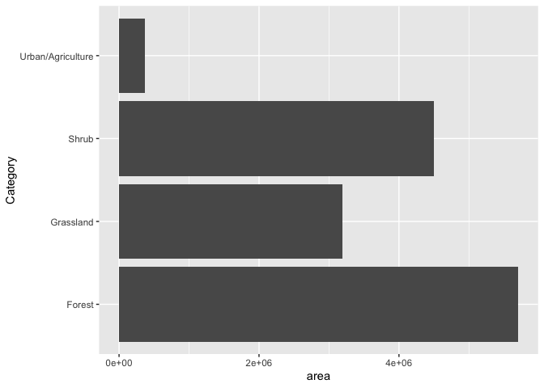
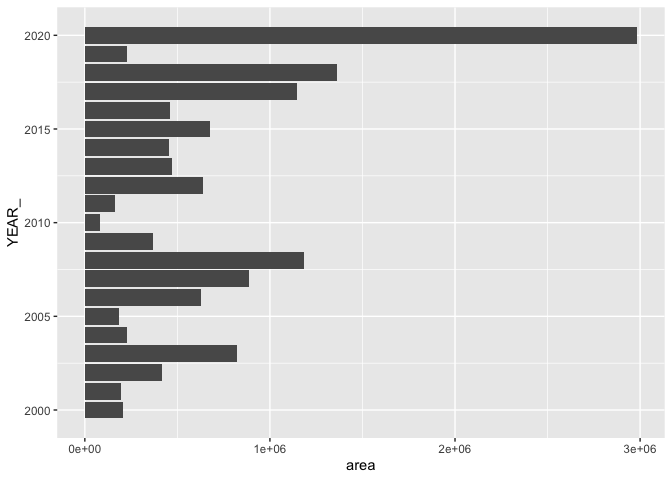
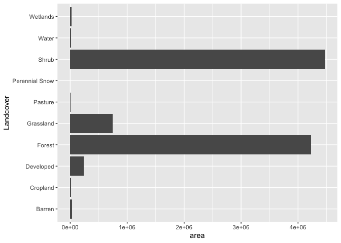
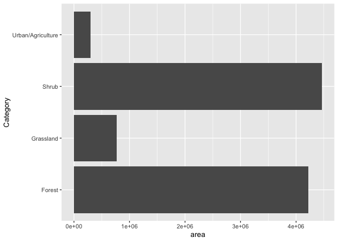
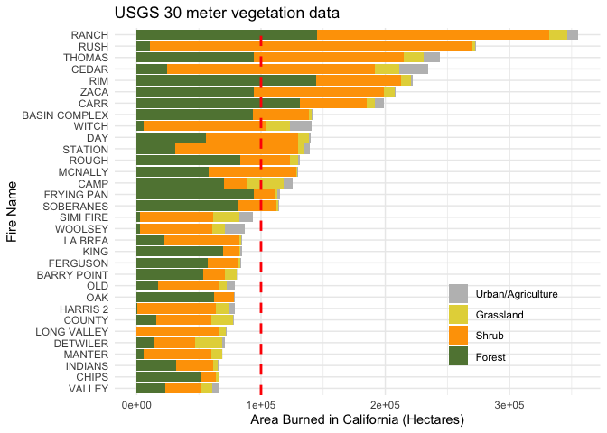
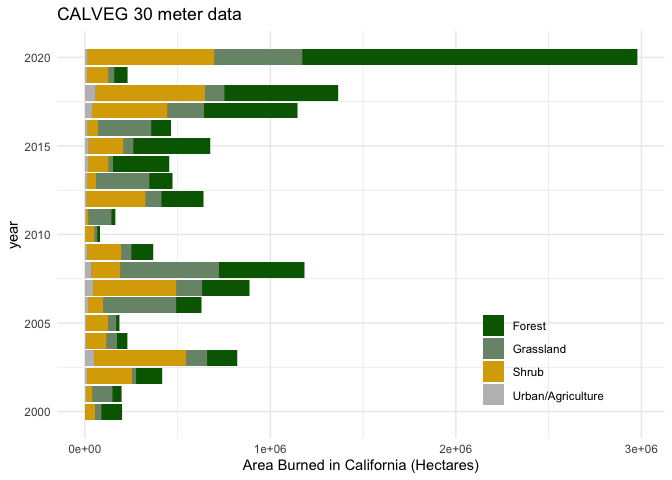
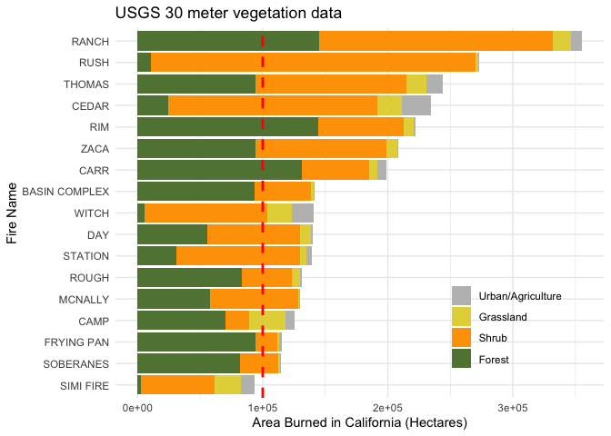

Land cover analysis
================
Millie Chapman
3/12/2019

This goes through the same analysis with both USGS and CALVEG vegetation
layers.

\#With CALVEG 30 - meter Vegetation Data

``` r
library(splitstackshape)
library(tidyverse)
```

    ## ── Attaching packages ──────────────────────────── tidyverse 1.3.0 ──

    ## ✓ ggplot2 3.3.2     ✓ purrr   0.3.4
    ## ✓ tibble  3.0.1     ✓ dplyr   1.0.0
    ## ✓ tidyr   1.1.0     ✓ stringr 1.4.0
    ## ✓ readr   1.3.1     ✓ forcats 0.5.0

    ## ── Conflicts ─────────────────────────────── tidyverse_conflicts() ──
    ## x dplyr::filter() masks stats::filter()
    ## x dplyr::lag()    masks stats::lag()

``` r
files <- dir("data/lc_data")

hist <- list()

for (i in 1:length(files)) {
  hist[[i]] <- read_csv(paste0("data/lc_data/", files[[i]])) %>%
  select(FIRE_NAME, GIS_ACRES, YEAR_,YEAR_num, histogram) %>%
  mutate(histogram = gsub('^.|.$', '', histogram))
}
```

    ## Parsed with column specification:
    ## cols(
    ##   .default = col_double(),
    ##   `system:index` = col_character(),
    ##   AGENCY = col_character(),
    ##   COMMENTS = col_logical(),
    ##   DtCrrnt = col_datetime(format = ""),
    ##   FIRE_NAME = col_character(),
    ##   FIRE_NUM = col_character(),
    ##   INC_NUM = col_character(),
    ##   STATE = col_character(),
    ##   UNIT_ID = col_character(),
    ##   histogram = col_character(),
    ##   source = col_character(),
    ##   .geo = col_logical()
    ## )

    ## See spec(...) for full column specifications.

    ## Parsed with column specification:
    ## cols(
    ##   .default = col_double(),
    ##   `system:index` = col_character(),
    ##   AGENCY = col_character(),
    ##   COMMENTS = col_character(),
    ##   DtCrrnt = col_logical(),
    ##   FIRE_NAME = col_character(),
    ##   FIRE_NUM = col_character(),
    ##   INC_NUM = col_character(),
    ##   STATE = col_character(),
    ##   UNIT_ID = col_character(),
    ##   histogram = col_character(),
    ##   source = col_logical(),
    ##   .geo = col_logical()
    ## )

    ## See spec(...) for full column specifications.

    ## Parsed with column specification:
    ## cols(
    ##   .default = col_double(),
    ##   `system:index` = col_character(),
    ##   AGENCY = col_character(),
    ##   COMMENTS = col_character(),
    ##   DtCrrnt = col_logical(),
    ##   FIRE_NAME = col_character(),
    ##   FIRE_NUM = col_character(),
    ##   INC_NUM = col_character(),
    ##   STATE = col_character(),
    ##   UNIT_ID = col_character(),
    ##   histogram = col_character(),
    ##   source = col_logical(),
    ##   .geo = col_logical()
    ## )

    ## See spec(...) for full column specifications.

    ## Parsed with column specification:
    ## cols(
    ##   .default = col_double(),
    ##   `system:index` = col_character(),
    ##   AGENCY = col_character(),
    ##   COMMENTS = col_character(),
    ##   DtCrrnt = col_logical(),
    ##   FIRE_NAME = col_character(),
    ##   FIRE_NUM = col_character(),
    ##   INC_NUM = col_character(),
    ##   STATE = col_character(),
    ##   UNIT_ID = col_character(),
    ##   histogram = col_character(),
    ##   source = col_logical(),
    ##   .geo = col_logical()
    ## )

    ## See spec(...) for full column specifications.

    ## Parsed with column specification:
    ## cols(
    ##   .default = col_double(),
    ##   `system:index` = col_character(),
    ##   AGENCY = col_character(),
    ##   COMMENTS = col_character(),
    ##   DtCrrnt = col_logical(),
    ##   FIRE_NAME = col_character(),
    ##   FIRE_NUM = col_character(),
    ##   INC_NUM = col_character(),
    ##   STATE = col_character(),
    ##   UNIT_ID = col_character(),
    ##   histogram = col_character(),
    ##   source = col_logical(),
    ##   .geo = col_logical()
    ## )

    ## See spec(...) for full column specifications.

    ## Parsed with column specification:
    ## cols(
    ##   .default = col_double(),
    ##   `system:index` = col_character(),
    ##   AGENCY = col_character(),
    ##   COMMENTS = col_character(),
    ##   DtCrrnt = col_logical(),
    ##   FIRE_NAME = col_character(),
    ##   FIRE_NUM = col_character(),
    ##   INC_NUM = col_character(),
    ##   STATE = col_character(),
    ##   UNIT_ID = col_character(),
    ##   histogram = col_character(),
    ##   source = col_logical(),
    ##   .geo = col_logical()
    ## )

    ## See spec(...) for full column specifications.

    ## Parsed with column specification:
    ## cols(
    ##   .default = col_double(),
    ##   `system:index` = col_character(),
    ##   AGENCY = col_character(),
    ##   COMMENTS = col_character(),
    ##   DtCrrnt = col_logical(),
    ##   FIRE_NAME = col_character(),
    ##   FIRE_NUM = col_character(),
    ##   INC_NUM = col_character(),
    ##   STATE = col_character(),
    ##   UNIT_ID = col_character(),
    ##   histogram = col_character(),
    ##   source = col_logical(),
    ##   .geo = col_logical()
    ## )

    ## See spec(...) for full column specifications.

    ## Parsed with column specification:
    ## cols(
    ##   .default = col_double(),
    ##   `system:index` = col_character(),
    ##   AGENCY = col_character(),
    ##   COMMENTS = col_character(),
    ##   DtCrrnt = col_logical(),
    ##   FIRE_NAME = col_character(),
    ##   INC_NUM = col_character(),
    ##   STATE = col_character(),
    ##   UNIT_ID = col_character(),
    ##   histogram = col_character(),
    ##   source = col_logical(),
    ##   .geo = col_logical()
    ## )

    ## See spec(...) for full column specifications.

``` r
fhist <- bind_rows(hist, .id = "column_label") %>%
  mutate(YEAR_ = replace_na(YEAR_, 2020))
```

``` r
landclass <- read_csv("data/USGS_key.csv")
```

    ## Parsed with column specification:
    ## cols(
    ##   histogram_1 = col_double(),
    ##   Landcover = col_character(),
    ##   Category = col_character(),
    ##   Description = col_character()
    ## )

``` r
library(splitstackshape)
#separate at =
fh <- fhist %>%
  cSplit("histogram", sep = ",", direction = "long") %>%
  cSplit("histogram", sep = "=", direction = "wide") %>%
  mutate(histogram_1 = as.numeric(histogram_1)) %>%
  left_join(landclass) 
```

    ## Joining, by = "histogram_1"

``` r
land_fire<- fh %>%
  group_by(Landcover) %>%
  summarise(area = sum(histogram_2)) %>% na.omit() %>%
  ggplot(aes(x=Landcover, y= area )) +
  geom_bar(stat="identity") + coord_flip()
```

    ## `summarise()` ungrouping output (override with `.groups` argument)

``` r
catagory_fire<- fh %>%
  group_by(Category) %>%
  summarise(area = sum(histogram_2) *0.078 *2.47105) %>%
  na.omit() %>%
  ggplot(aes(x=Category, y= area )) +
  geom_bar(stat="identity") + coord_flip()
```

    ## `summarise()` ungrouping output (override with `.groups` argument)

``` r
catagory_fire
```

<!-- -->

``` r
year_fire<- fh %>%
  group_by(YEAR_) %>%
  summarise(area = sum(histogram_2) *0.078 *2.47105) %>%
  na.omit() %>%
  ggplot(aes(x=YEAR_, y= area )) +
  geom_bar(stat="identity") + coord_flip()
```

    ## `summarise()` ungrouping output (override with `.groups` argument)

``` r
year_fire
```

<!-- -->

``` r
fire_perc<- fh %>%  
  group_by(FIRE_NAME, Category, GIS_ACRES, YEAR_) %>%
  summarise(area = sum(histogram_2)) %>%
  mutate(area = area * .078 * 2.47) %>%
 # filter(area>75000) %>%
  na.omit() %>% 
  group_by(YEAR_) %>% 
  mutate(sumarea = sum(GIS_ACRES)) %>% 
  arrange(desc(area))
```

    ## `summarise()` regrouping output by 'FIRE_NAME', 'Category', 'GIS_ACRES' (override with `.groups` argument)

``` r
cols <- c("Forest" = "darkgreen", "Grassland" = "#799479", "Shrub" = "#DBA901", "Urban/Agriculture" = "gray") 

calveg_fires<- ggplot(fire_perc, aes(x= YEAR_, y=area, fill= Category)) + 
  geom_bar(stat="identity") + 
  scale_colour_manual(values = cols, aesthetics = c("colour", "fill")) +
  theme_minimal() +coord_flip() +
  labs(y= "Area Burned in California (Hectares)", x= "year", title = "CALVEG 30 meter data") +
  theme(legend.title=element_blank(), legend.position = c(0.8, 0.2)) 
  #geom_hline(yintercept=100000, linetype="dashed", 
               # color = "red", size=1)
```

## With USGS 30 meter Vegetation Data

Pull in frequency histogram from google earth engine

``` r
fhist<-read_csv("data/landcover_fires_USGS.csv")
```

    ## Parsed with column specification:
    ## cols(
    ##   `system:index` = col_character(),
    ##   AGENCY = col_character(),
    ##   ALARM_DATE = col_double(),
    ##   CAUSE = col_double(),
    ##   COMPLEXNM = col_character(),
    ##   CONT_DATE = col_double(),
    ##   FIRE_NAME = col_character(),
    ##   GIS_ACRES = col_double(),
    ##   INCOMPLEX = col_character(),
    ##   MAPMETHOD = col_character(),
    ##   YEAR = col_double(),
    ##   YEARn = col_double(),
    ##   histogram = col_character(),
    ##   .geo = col_logical()
    ## )

``` r
landclass <- read_csv("data/USGS_key.csv")
```

    ## Parsed with column specification:
    ## cols(
    ##   histogram_1 = col_double(),
    ##   Landcover = col_character(),
    ##   Category = col_character(),
    ##   Description = col_character()
    ## )

``` r
structures<- read_csv("data/structures_cost_calfire.csv")
```

    ## Warning: Missing column names filled in: 'X8' [8]

    ## Parsed with column specification:
    ## cols(
    ##   FIRE_NAME = col_character(),
    ##   YEAR = col_double(),
    ##   STRUCTURES_DEST = col_double(),
    ##   COST = col_double(),
    ##   DEATHS = col_double(),
    ##   TOP_20_DEST = col_character(),
    ##   TOP_20_LG = col_character(),
    ##   X8 = col_character()
    ## )

``` r
structures<-structures %>%
  group_by(FIRE_NAME, YEAR) %>%
  summarise(structures_destroyed = mean(STRUCTURES_DEST),
            cost = mean(COST),
            DEATHS = mean(DEATHS)) %>%
  filter(cost>10)
```

    ## `summarise()` regrouping output by 'FIRE_NAME' (override with `.groups` argument)

``` r
#separate at =
fh <- fhist %>%
  cSplit("histogram", sep = ",", direction = "long") %>%
  cSplit("histogram", sep = "=", direction = "wide") %>%
  left_join(landclass) 
```

    ## Joining, by = "histogram_1"

``` r
usgs_landcover_fire<- fh %>%
  group_by(Landcover) %>%
  summarise(area = sum(histogram_2) *0.078 *2.47105) %>%
  na.omit() %>%
  ggplot(aes(x=Landcover, y= area )) +
  geom_bar(stat="identity") + coord_flip()
```

    ## `summarise()` ungrouping output (override with `.groups` argument)

``` r
usgs_landcover_fire
```

<!-- -->

``` r
catagory_fire<- fh %>%
  group_by(Category) %>%
  summarise(area = sum(histogram_2) *0.078 *2.47105) %>%
  na.omit() %>%
  ggplot(aes(x=Category, y= area )) +
  geom_bar(stat="identity") + coord_flip()
```

    ## `summarise()` ungrouping output (override with `.groups` argument)

``` r
catagory_fire
```

<!-- -->

``` r
#Remove duplicate THOMAS 2017 fire
fh <- fh %>%
  filter(., FIRE_NAME != "THOMAS" | AGENCY != "C&L")

#Remove duplicate RANCH 2018 fire
fh <- fh %>%
  filter(.,FIRE_NAME != "RANCH" | MAPMETHOD != "Mixed Methods")
#Remove Biscuit Fire (Most of fire occurs in Oregon)
fh <- fh %>%
  filter(., FIRE_NAME != "BISCUIT")

fire_perc<- fh %>%  
  mutate(YEARn = as.numeric(YEAR)) %>%
  filter(YEARn>30,
         GIS_ACRES>75000) %>%
  group_by(FIRE_NAME, Category, GIS_ACRES, YEARn) %>%
  left_join(structures) %>%
  summarise(area = sum(histogram_2)) %>%
  mutate(area = area * .078 * 2.47) %>%
  na.omit() 
```

    ## Joining, by = c("FIRE_NAME", "YEAR")

    ## `summarise()` regrouping output by 'FIRE_NAME', 'Category', 'GIS_ACRES' (override with `.groups` argument)

``` r
cols <- c("Forest" = "darkgreen", "Grassland" = "#799479", "Shrub" = "#DBA901", "Urban/Agriculture" = "gray") 

cols <- c("Forest" = "#608341",  #"darkgreen" 
          "Grassland" = "#e4d547",#A0522D 
          "Shrub" = "#fea201", #DEB887
          "Urban/Agriculture" = "gray") 

fire_perc$Category<-factor(fire_perc$Category, levels=c('Urban/Agriculture', 
                                                           'Grassland',
                                                           'Shrub',
                                                           'Forest'))
USGS_fires<- fire_perc %>%
  arrange(desc(Category)) %>%
  ggplot(aes(x=reorder(FIRE_NAME, GIS_ACRES), y=area, fill= Category)) + 
  geom_bar(stat="identity") + 
  scale_colour_manual(values = cols, aesthetics = c("colour", "fill")) +
  theme_minimal() +coord_flip() +
  labs(y= "Area Burned in California (Hectares)", x= "Fire Name",  title = "USGS 30 meter vegetation data") +
  theme(legend.title=element_blank(), legend.position = c(0.8, 0.2)) +
  geom_hline(yintercept=100000, linetype="dashed", 
             color = "red", size=1)
USGS_fires
```

<!-- -->

``` r
#Is the Biscuit Fire here only showing land burned in CA?

USGS_fires
```

<!-- -->

``` r
calveg_fires
```

<!-- -->

``` r
megafire_perc <- fire_perc %>%
  filter(GIS_ACRES >= 100000)

megafires<- ggplot(megafire_perc, aes(x=reorder(FIRE_NAME, GIS_ACRES), y=area, fill= Category)) + 
  geom_bar(stat="identity") + 
  scale_colour_manual(values = cols, aesthetics = c("colour", "fill")) +
  theme_minimal() +coord_flip() +
  labs(y= "Area Burned in California (Hectares)", x= "Fire Name",  title = "USGS 30 meter vegetation data") +
  theme(legend.title=element_blank(), legend.position = c(0.8, 0.2)) +
  geom_hline(yintercept=100000, linetype="dashed", 
                color = "red", size=1)
megafires
```

<!-- -->

``` r
fire_final <- fire_perc %>% 
  transform(FIRE_NAME = map_chr(FIRE_NAME, str_to_title)) %>% 
  #mutate(c = ifelse(GIS_ACRES > 100000, "red", "black")) %>% 
  group_by(FIRE_NAME) %>% 
  mutate(sumarea = sum(GIS_ACRES)) %>% 
  arrange(desc(sumarea))

fire_final$FIRE_NAME[29:32]="Basin"

# name_color <- fire_final %>% 
#   select(FIRE_NAME,GIS_ACRES, sumarea) %>% 
#   distinct() 
# name_color <- name_color %>% 
#   mutate(c = ifelse(GIS_ACRES > 100000, "red", "black")) %>% 
#   arrange(sumarea)
# a <- name_color$c

final_fig<- fire_final %>%
  arrange(desc(sumarea)) %>% 
  arrange(desc(Category)) %>%
  ggplot(aes(x=reorder(FIRE_NAME, sumarea), y=area, fill= Category, width= 0.8)) + 
  geom_bar(stat="identity") +
  guides(fill = guide_legend(reverse = TRUE)) +
  scale_colour_manual(values = cols, aesthetics = c("colour", "fill")) +
  scale_y_continuous(labels = scales::comma, expand = c(0, 0)) +
  theme_classic() +
  theme(plot.margin = unit(c(1,3,1,1), "lines"), 
        axis.title=element_text(size=9,face="bold", family = "Helvetica"),
        legend.text = element_text(colour="black", size=8, family = "Helvetica"),
        axis.text.x = element_text(size=8, family = "Helvetica"),
        axis.text.y = element_text(size=8, family = "Helvetica"), 
        legend.position = "bottom") +
    labs(y = "Acres Burned in California", 
       x = element_blank(),
       fill = element_blank()) +
  coord_flip() 

final_fig
```

<!-- -->
