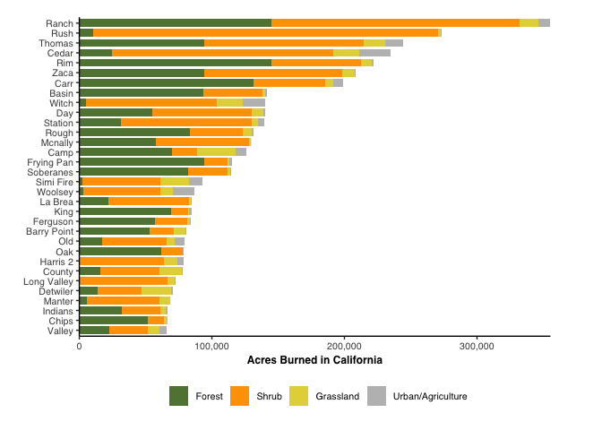

Land cover analysis
================
Millie Chapman
3/12/2019

This goes through the same analysis with both USGS and CALVEG vegetation layers.

With CALVEG 30 - meter Vegetation Data
======================================

``` r
library(splitstackshape)
```

    ## Warning: package 'splitstackshape' was built under R version 3.4.4

``` r
library(tidyverse)
```

    ## Warning: package 'tidyverse' was built under R version 3.4.2

    ## ── Attaching packages ──────────────────────────────────────────────────────────────────────────────── tidyverse 1.2.1 ──

    ## ✔ ggplot2 3.1.0     ✔ purrr   0.2.5
    ## ✔ tibble  1.4.2     ✔ dplyr   0.7.8
    ## ✔ tidyr   0.8.1     ✔ stringr 1.3.1
    ## ✔ readr   1.1.1     ✔ forcats 0.2.0

    ## Warning: package 'ggplot2' was built under R version 3.4.4

    ## Warning: package 'tibble' was built under R version 3.4.3

    ## Warning: package 'tidyr' was built under R version 3.4.4

    ## Warning: package 'purrr' was built under R version 3.4.4

    ## Warning: package 'dplyr' was built under R version 3.4.4

    ## Warning: package 'stringr' was built under R version 3.4.4

    ## ── Conflicts ─────────────────────────────────────────────────────────────────────────────────── tidyverse_conflicts() ──
    ## ✖ dplyr::filter() masks stats::filter()
    ## ✖ dplyr::lag()    masks stats::lag()

``` r
fhist<-read_csv("data/landcover_fire_histogram.csv")
```

    ## Parsed with column specification:
    ## cols(
    ##   `system:index` = col_character(),
    ##   AGENCY = col_character(),
    ##   ALARM_DATE = col_double(),
    ##   CAUSE = col_integer(),
    ##   COMPLEXNM = col_character(),
    ##   CONT_DATE = col_double(),
    ##   FIRE_NAME = col_character(),
    ##   GIS_ACRES = col_double(),
    ##   INCOMPLEX = col_character(),
    ##   MAPMETHOD = col_character(),
    ##   YEAR = col_integer(),
    ##   YEARn = col_integer(),
    ##   histogram = col_character(),
    ##   .geo = col_character()
    ## )

``` r
landclass <- read_csv("data/landclass.csv")
```

    ## Parsed with column specification:
    ## cols(
    ##   histogram_1 = col_integer(),
    ##   Landcover = col_character(),
    ##   Category = col_character()
    ## )

``` r
library(splitstackshape)
#separate at =
fh <- fhist %>%
  cSplit("histogram", sep = ",", direction = "long") %>%
  cSplit("histogram", sep = "=", direction = "wide") %>%
  left_join(landclass) 
```

    ## Joining, by = "histogram_1"

``` r
land_fire<- fh %>%
  group_by(Landcover) %>%
  summarise(area = sum(histogram_2)) %>% na.omit() %>%
  ggplot(aes(x=Landcover, y= area )) +
  geom_bar(stat="identity") + coord_flip()
land_fire
```


``` r
catagory_fire<- fh %>%
  group_by(Category) %>%
  summarise(area = sum(histogram_2) *0.078 *2.47105) %>%
  na.omit() %>%
  ggplot(aes(x=Category, y= area )) +
  geom_bar(stat="identity") + coord_flip()
```

    ## Warning: package 'bindrcpp' was built under R version 3.4.4

``` r
catagory_fire
```


``` r
fire_perc<- fh %>%  
  mutate(YEARn = as.numeric(YEAR)) %>%
  filter(YEARn>30,
         GIS_ACRES>75000) %>%
  group_by(FIRE_NAME, Category, GIS_ACRES, YEARn) %>%
  summarise(area = sum(histogram_2)) %>%
  mutate(area = area * .078 * 2.47) %>%
  na.omit() %>% 
  group_by(FIRE_NAME) %>% 
  mutate(sumarea = sum(GIS_ACRES)) %>% 
  arrange(desc(sumarea))

cols <- c("Forest" = "darkgreen", "Grassland" = "#799479", "Shrub" = "#DBA901", "Urban/Agriculture" = "gray") 

calveg_fires<- ggplot(fire_perc, aes(x=reorder(FIRE_NAME, GIS_ACRES), y=area, fill= Category)) + 
  geom_bar(stat="identity") + 
  scale_colour_manual(values = cols, aesthetics = c("colour", "fill")) +
  theme_minimal() +coord_flip() +
  labs(y= "Area Burned in California (Hectares)", x= "Fire Name", title = "CALVEG 30 meter data") +
  theme(legend.title=element_blank(), legend.position = c(0.8, 0.2)) +
  geom_hline(yintercept=100000, linetype="dashed", 
                color = "red", size=1)
```

With USGS 30 meter Vegetation Data
----------------------------------

Pull in frequency histogram from google earth engine

``` r
fhist<-read_csv("data/landcover_fires_USGS.csv")
```

    ## Parsed with column specification:
    ## cols(
    ##   `system:index` = col_character(),
    ##   AGENCY = col_character(),
    ##   ALARM_DATE = col_double(),
    ##   CAUSE = col_integer(),
    ##   COMPLEXNM = col_character(),
    ##   CONT_DATE = col_double(),
    ##   FIRE_NAME = col_character(),
    ##   GIS_ACRES = col_double(),
    ##   INCOMPLEX = col_character(),
    ##   MAPMETHOD = col_character(),
    ##   YEAR = col_integer(),
    ##   YEARn = col_integer(),
    ##   histogram = col_character(),
    ##   .geo = col_character()
    ## )

``` r
landclass <- read_csv("data/USGS_key.csv")
```

    ## Parsed with column specification:
    ## cols(
    ##   histogram_1 = col_integer(),
    ##   Landcover = col_character(),
    ##   Category = col_character(),
    ##   Description = col_character()
    ## )

``` r
structures<- read_csv("data/structures_cost_calfire.csv")
```

    ## Warning: Missing column names filled in: 'X8' [8]

    ## Parsed with column specification:
    ## cols(
    ##   FIRE_NAME = col_character(),
    ##   YEAR = col_integer(),
    ##   STRUCTURES_DEST = col_integer(),
    ##   COST = col_integer(),
    ##   DEATHS = col_integer(),
    ##   TOP_20_DEST = col_character(),
    ##   TOP_20_LG = col_character(),
    ##   X8 = col_character()
    ## )

``` r
structures<-structures %>%
  group_by(FIRE_NAME, YEAR) %>%
  summarise(structures_destroyed = mean(STRUCTURES_DEST),
            cost = mean(COST),
            DEATHS = mean(DEATHS)) %>%
  filter(cost>10)
#separate at =
fh <- fhist %>%
  cSplit("histogram", sep = ",", direction = "long") %>%
  cSplit("histogram", sep = "=", direction = "wide") %>%
  left_join(landclass) 
```

    ## Joining, by = "histogram_1"

``` r
usgs_landcover_fire<- fh %>%
  group_by(Landcover) %>%
  summarise(area = sum(histogram_2) *0.078 *2.47105) %>%
  na.omit() %>%
  ggplot(aes(x=Landcover, y= area )) +
  geom_bar(stat="identity") + coord_flip()
usgs_landcover_fire
```


``` r
catagory_fire<- fh %>%
  group_by(Category) %>%
  summarise(area = sum(histogram_2) *0.078 *2.47105) %>%
  na.omit() %>%
  ggplot(aes(x=Category, y= area )) +
  geom_bar(stat="identity") + coord_flip()
catagory_fire
```


``` r
fire_perc2<- fh %>%  
  mutate(YEARn = as.numeric(YEAR)) %>%
  filter(YEARn>30,
         GIS_ACRES>75000) %>%
  group_by(FIRE_NAME, Category, GIS_ACRES, YEARn) %>%
  left_join(structures) %>%
  summarise(area = sum(histogram_2)) %>%
  mutate(area = area * .078 * 2.47) %>%
  na.omit() 
```

    ## Joining, by = c("FIRE_NAME", "YEAR")

``` r
cols <- c("Forest" = "darkgreen", "Grassland" = "#799479", "Shrub" = "#DBA901", "Urban/Agriculture" = "gray") 

cols <- c("Forest" = "darkgreen", 
          "Grassland" = "#e4d547",#A0522D 
          "Shrub" = "#fea201", #DEB887
          "Urban/Agriculture" = "gray") 

fire_perc$Category<-factor(fire_perc$Category, levels=c('Urban/Agriculture', 
                                                           'Grassland',
                                                           'Shrub',
                                                           'Forest'))
USGS_fires<- fire_perc %>%
  arrange(desc(Category)) %>%
  ggplot(aes(x=reorder(FIRE_NAME, GIS_ACRES), y=area, fill= Category)) + 
  geom_bar(stat="identity") + 
  scale_colour_manual(values = cols, aesthetics = c("colour", "fill")) +
  theme_minimal() +coord_flip() +
  labs(y= "Area Burned in California (Hectares)", x= "Fire Name",  title = "USGS 30 meter vegetation data") +
  theme(legend.title=element_blank(), legend.position = c(0.8, 0.2)) +
  geom_hline(yintercept=100000, linetype="dashed", 
             color = "red", size=1)
USGS_fires
```


``` r
USGS_fires
```


``` r
calveg_fires
```


``` r
megafire_perc <- fire_perc2 %>%
  filter(GIS_ACRES >= 100000)

megafires<- ggplot(megafire_perc, aes(x=reorder(FIRE_NAME, GIS_ACRES), y=area, fill= Category)) + 
  geom_bar(stat="identity") + 
  scale_colour_manual(values = cols, aesthetics = c("colour", "fill")) +
  theme_minimal() +coord_flip() +
  labs(y= "Area Burned in California (Hectares)", x= "Fire Name",  title = "USGS 30 meter vegetation data") +
  theme(legend.title=element_blank(), legend.position = c(0.8, 0.2)) +
  geom_hline(yintercept=100000, linetype="dashed", 
                color = "red", size=1)
megafires
```


``` r
fire_final <- fire_perc %>% 
  transform(FIRE_NAME = map_chr(FIRE_NAME, str_to_title)) %>% 
  #mutate(c = ifelse(GIS_ACRES > 100000, "red", "black")) %>% 
  group_by(FIRE_NAME) %>% 
  mutate(sumarea = sum(GIS_ACRES)) %>% 
  arrange(desc(sumarea))

name_color <- fire_final %>% 
  select(FIRE_NAME,GIS_ACRES, sumarea) %>% 
  distinct() 
name_color <- name_color[-c(2:3),]
name_color <- name_color %>% 
  mutate(c = ifelse(GIS_ACRES > 100000, "red", "black")) %>% 
  arrange(sumarea)
a <- name_color$c

final_fig<- fire_final %>%
  arrange(desc(sumarea)) %>% 
  arrange(desc(Category)) %>%
  ggplot(aes(x=reorder(FIRE_NAME, sumarea), y=area, fill= Category)) + 
  geom_bar(stat="identity") +
  scale_colour_manual(values = cols, aesthetics = c("colour", "fill")) +
  scale_y_continuous(labels = scales::comma) +
  theme_classic() +
  theme(axis.title=element_text(size=9,face="bold", family = "Helvetica"),
        legend.text = element_text(colour="black", size=8, family = "Helvetica"),
        axis.text.x = element_text(size=9, family = "Helvetica"),
        axis.text.y = element_text(size=9, family = "Helvetica", colour = a), 
        legend.position = "bottom") +
  coord_flip() +
  labs(y = "Hectares Burned in California", 
       x = element_blank(),
       fill = element_blank())

final_fig
```


